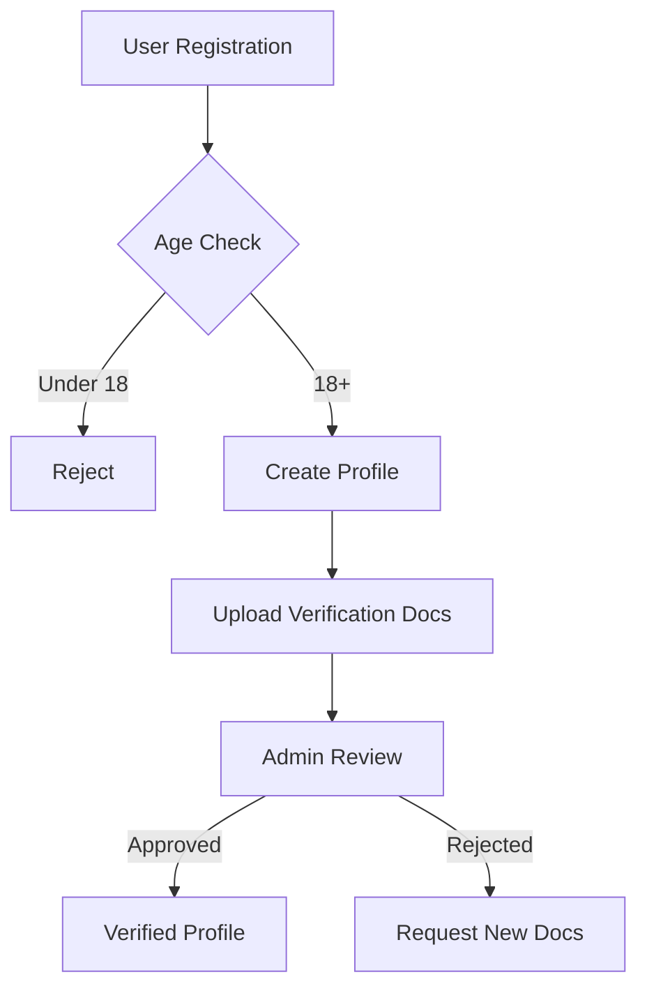
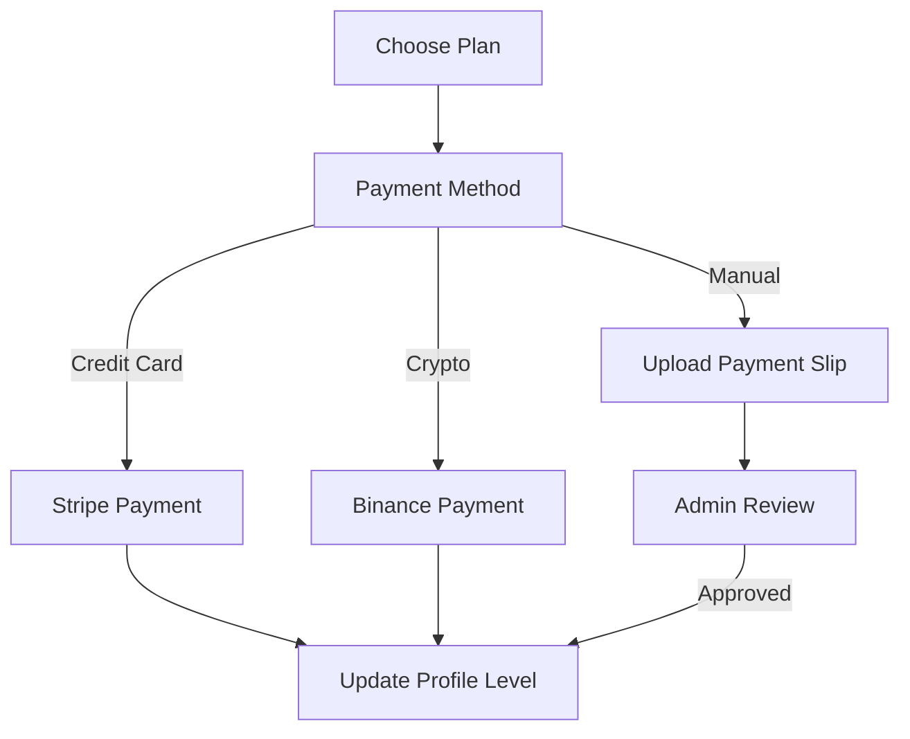
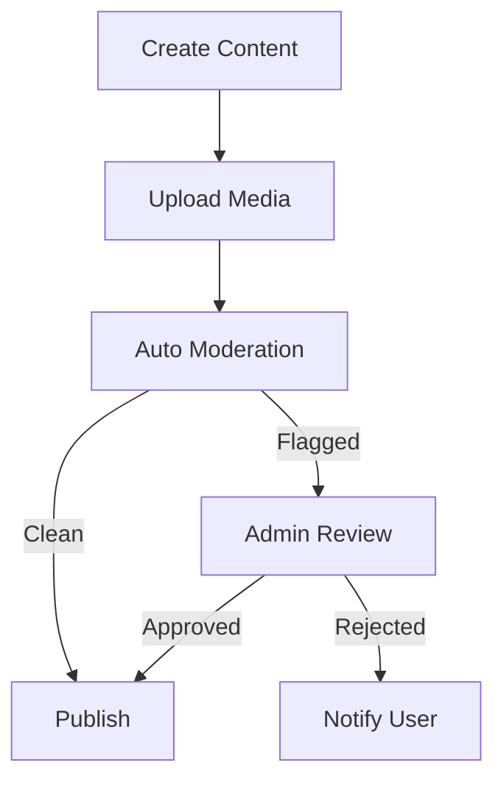

# Vesta Project Summary

## Architecture Overview

### Backend Stack
- Node.js + Express.js
- Supabase for database and authentication
- Socket.IO for real-time features
- PM2 for process management

### Frontend Stack
- React 18+ with TypeScript
- Material UI / Chakra UI
- React Query for state management
- React Router for navigation

## Database Schemas

### UserProfile Schema
```typescript
{
  username: String,
  email: String,
  password: String,
  birthdate: Date,
  fullName: String,
  profilePicture: String,
  bio: String,
  services: {
    included: [String],
    extra: Object
  },
  rates: {
    incall: Number,
    outcall: Number
  },
  physicalAttributes: {
    gender: String,
    height: Number,
    weight: Number,
    ethnicity: String,
    bustSize: String,
    bustType: String,
    pubicHair: String,
    tattoos: Boolean,
    piercings: Boolean
  },
  availableToMeet: {
    meetingWith: [String],
    available24_7: Boolean,
    advanceBooking: Boolean
  },
  contact: {
    phone: String,
    country: String,
    city: String,
    location: {
      type: String,
      coordinates: [Number]
    }
  },
  workingTime: Object,
  profileLevel: {
    type: String,
    enum: ['free', 'standard', 'premium', 'vip']
  },
  subscription: {
    stripeSubscriptionId: String,
    status: String,
    currentPeriodEnd: Date,
    startDate: Date
  },
  videoSubscription: {
    isSubscribed: Boolean,
    subscribedAt: Date,
    expiresAt: Date
  },
  subscriberVideo: {
    url: String,
    uploadedAt: Date,
    title: String,
    description: String,
    likes: Number,
    likedBy: [String]
  },
  verified: Boolean,
  verificationStatus: String,
  verificationDocuments: [{
    data: String,
    side: String,
    uploadedAt: Date
  }],
  images: [String],
  videos: [String],
  userlikes: Number,
  viewerlikes: Number,
  moderationFlags: {
    contentWarnings: [String],
    lastReviewed: Date,
    reviewerNotes: String,
    flaggedMedia: [{
      mediaId: String,
      reason: String,
      flaggedAt: Date
    }]
  }
}
```

### Admin Schema
```typescript
{
  username: String,
  email: String,
  password: String,
  permissions: {
    canCreateAdmin: Boolean,
    canEditProfiles: Boolean,
    canModerateContent: Boolean,
    canManagePayments: Boolean
  },
  lastLogin: Date,
  manualPaymentData: [ObjectId]
}
```

### Payment Schema
```typescript
{
  userId: ObjectId,
  amount: Number,  
  currency: String,
  stripePaymentId: String,
  status: String,
  serviceDetails: {
    plan: String,
    description: String
  },
  type: String,
  createdAt: Date
}
```

## API Routes

### Authentication Routes (/api/auth)
- POST /register - User registration
- POST /login - User login
- GET /me - Get current user
- GET /user/:email - Check if user exists

### Profile Routes (/api/profiles)
- POST /update - Update profile
- GET /:id - Get public profile
- GET /filter - Filter profiles by role
- GET /location - Filter profiles by location
- GET /profiles - Get all profiles with filters
- POST /:id/like/user - Add user like
- POST /:id/like/viewer - Add viewer like
- PATCH /field/:fieldName - Update specific field
- DELETE /:id - Delete profile
- PUT /:userId/images - Update images
- PUT /:userId/videos - Update videos
- POST /:id/verification-documents - Upload verification documents

### Media Routes (/media)
- POST /upload-images - Upload profile images
- POST /profile-picture/:userId - Upload profile picture
- POST /video-upload-subscriber - Upload subscriber video
- POST /payment-slip - Upload payment slip
- GET /:id - Get media file

### Payment Routes (/api/payments)
- POST /create-payment-intent - Create Stripe payment intent
- POST /create-subscription - Create subscription
- POST /create-binance-payment - Create crypto payment
- POST /webhook - Stripe webhook handler
- POST /confirm-manual-payment/:id - Confirm manual payment

### Admin Routes (/api/admin)
- POST /login - Admin login
- POST /create - Create new admin
- GET /profiles - Get all profiles
- PATCH /profiles/:id - Update any profile
- DELETE /profiles/:id - Delete profile
- GET /users/files - Get all profiles with files
- DELETE /users/:userId/files/:fileType/:fileId - Delete user file
- PATCH /profiles/:id/moderation - Update moderation flags

### Video Routes (/api/videos)
- GET /subscription-status - Get subscription status
- GET /subscriber-video - Get current subscriber video
- POST /subscriber-video - Upload subscriber video
- POST /:videoId/like - Like video
- POST /:videoId/unlike - Unlike video

## Core Features

1. User Management
- Registration with age verification
- Profile creation and management
- Role-based access control
- Document verification system

2. Media Management 
- Image upload with limits
- Video upload for subscribers
- Profile picture management
- Verification document upload

3. Subscription System
- Multiple subscription tiers (Free, Standard, Premium, VIP)
- Video content subscription
- Payment processing (Stripe, Crypto)
- Manual payment handling

4. Content Moderation
- Admin review system
- Content flagging
- Media moderation
- User verification

5. Search & Discovery
- Location-based search
- Service filtering
- Profile level prioritization
- Like system

6. Security Features
- JWT authentication
- Rate limiting
- Input validation
- File type verification
- CORS configuration

## Workflow

1. User Registration & Verification


2. Subscription Process


3. Content Publishing


## AI Development Instructions

### Phase 1: Project Setup & Infrastructure

1. Project Initialization:
```prompt
Create a new React project using Vite:
- Set up React with TypeScript
- Install and configure Material UI or Chakra UI
- Set up React Router for navigation
- Configure React Query for data fetching
- Set up Express.js backend
- Initialize Supabase project and configure environment
```

2. Database Setup:
```prompt
Set up Supabase database with the following:
- Create tables for UserProfile, Admin, and Payment with proper relationships
- Set up Row Level Security (RLS) policies
- Configure authentication with email and social providers
- Set up storage buckets for media files
- Create database functions and triggers
- Set up real-time subscriptions
```

3. Security Configuration:
```prompt
Implement security features:
- Configure Supabase authentication policies
- Set up storage security rules
- Implement API middleware security
- Configure CORS and rate limiting
- Set up secure file upload validation 
Create environment configuration for dev/prod.
```

4. API Layer:
```prompt
Create API infrastructure:
- Set up Supabase client with types
- Create React Query hooks for data fetching
- Implement API error handling
- Set up WebSocket connection
- Create API middleware
Build reusable API utilities.
```

### Phase 2: Core Features Implementation

5. Authentication System:
```prompt
Implement authentication using Supabase Auth:
- User signup with age verification
- Email and social login
- Protected routes with React Router
- Admin authentication
- Password reset flow
Create authentication context and hooks.
```

6. Profile Management:
```prompt
Build profile system with Supabase:
- Profile CRUD operations
- Image/video upload to Supabase Storage
- Profile verification system
- Search and filtering using Postgres full-text search
- Real-time profile updates
Create profile components using Material UI.
```

7. Media Management:
```prompt
Implement media system using Supabase Storage:
- Image upload with preview
- Video upload for subscribers
- Storage bucket organization
- Media optimization
- Content moderation with webhooks
Create media management components.
```

### Phase 3: Frontend Development

14. Layout & Navigation:
```prompt
Create base layout components:
- Responsive navigation header with user menu
- Protected route layouts
- Admin dashboard layout
- Mobile-friendly sidebar navigation
- Theme provider with dark/light modes
- Toast notification system
- Loading states and error boundaries
```

15. Public Pages:
```prompt
Build public-facing pages:
- Home page with profile grid and filters
- Landing page with feature highlights
- Search page with advanced filtering
- Pricing page with subscription plans
- About/FAQ pages
- Terms & Privacy pages
- Contact/Support page
Implement SEO optimization and meta tags.
```

16. User Profile Pages:
```prompt
Create profile-related pages:
- Profile view page with media gallery
- Profile edit page with form validation
- Profile settings dashboard
- Media management page
- Subscription management page
- Verification status page
- Profile analytics page
Add real-time updates and optimistic UI.
```

17. Authentication Pages:
```prompt
Develop authentication flows:
- Registration with multi-step form
- Login with social providers
- Password reset flow
- Email verification
- Two-factor authentication
- Account recovery
Create smooth transitions between auth states.
```

18. Payment & Subscription Pages:
```prompt
Build payment-related interfaces:
- Subscription checkout pages
- Payment method management
- Manual payment upload flow
- Transaction history
- Invoice/receipt views
- Subscription upgrade/downgrade
Implement loading and success states.
```

19. Chat & Messaging:
```prompt
Develop messaging interfaces:
- Chat inbox layout
- Conversation thread view
- Message composer with attachments
- Real-time message updates
- Chat notifications
- Online status indicators
Add typing indicators and read receipts.
```

20. Admin Interfaces:
```prompt
Create admin dashboard pages:
- Overview dashboard with metrics
- User management interface
- Content moderation queue
- Payment verification panel
- Analytics & reporting
- Settings & configuration
Implement admin-specific features and permissions.
```

21. Shared Components:
```prompt
Build reusable components:
- Media upload components
- Form input components
- Data tables and grids
- Modal and dialog system
- Card and list components
- Loading skeletons
- Error states and empty states
Create component documentation with Storybook.
```

### Phase 4: Advanced Features

8. Payment Integration:
```prompt
Set up payment system:
- Stripe Elements integration
- Binance payment API
- Subscription management
- Payment webhooks
- Manual payment verification
Create payment components and hooks.
```

9. Subscription Features:
```prompt
Build subscription system:
- Subscription plans table in Supabase
- Subscription status management
- Access control based on subscription
- Video content gating
Create subscription management UI.
```

10. Admin Dashboard:
```prompt
Create React admin interface:
- User management dashboard
- Content moderation tools
- Payment verification system
- Analytics with Supabase metrics
- Profile verification workflow
Build admin components with Material UI.
```

### Phase 5: Testing & Deployment 

11. Testing Implementation:
```prompt
Set up testing infrastructure:
- React Testing Library setup
- API mocking utilities
- Integration tests
- E2E tests with Cypress
- Performance testing
Create test utilities and helpers.
```

12. Deployment Setup:
```prompt
Configure deployment:
- Vercel/Netlify for frontend
- Railway/Heroku for backend
- Supabase production setup
- CI/CD pipeline
- SSL and domain setup
Create deployment documentation.
```

### Phase 6: Optimization

13. Performance Optimization:
```prompt
Implement optimizations:
- React Query caching strategy
- Image optimization with Supabase transformations
- Code splitting and lazy loading
- Database query optimization
- Frontend bundle optimization
Add performance monitoring.
```

### Development Notes:
- Use TypeScript strict mode
- Follow React best practices
- Implement proper error boundaries
- Use React Suspense for loading states
- Follow Supabase security best practices
- Document using Storybook
- Maintain high test coverage
- Use feature branch workflow

### Security Considerations:
- Implement proper RLS policies
- Secure file upload handling
- API rate limiting
- Input sanitization
- Secure WebSocket connections
- Regular security audits
- Proper access control
- Data encryption at rest

### Performance Requirements:
- First contentful paint under 1.5s
- Time to interactive under 3.5s
- Efficient data fetching with React Query
- Proper Supabase query optimization
- Image optimization strategy
- CDN usage for media
- Lazy loading implementation

Follow these instructions sequentially for a modern, secure React + Supabase application.
